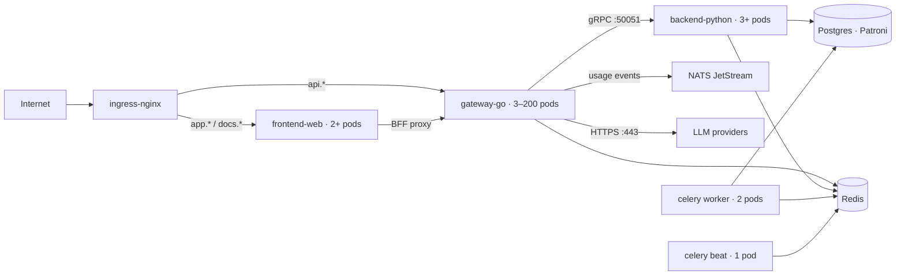

# Shipping the Gateway — Docker & Kubernetes Deep Dive

A guided deep dive into how this repo packages, composes, and orchestrates four services — every concept taught from the actual files in this working tree, ending in six hands-on labs.

**Repo deployment inventory:** 5 Dockerfiles · 3 compose files · kustomize base + 3 overlays · Helm chart · Terraform (dev)
**Local tooling at time of writing:** docker 29.7 ✓ · kubectl ✗ · kind ✗ · helm ✗ (Lab 0 fixes this)

---

## Contents

- [Part 0 — The deployment surface](#part-0--the-deployment-surface-of-this-repo)
- [Part 1 — Three Dockerfiles, three philosophies](#part-1--three-dockerfiles-three-philosophies)
- [Part 2 — Compose: the two-file overlay](#part-2--compose-the-two-file-overlay)
- [Part 3 — Kubernetes workloads, line by line](#part-3--kubernetes-workloads-line-by-line)
- [Part 4 — Config & secrets](#part-4--config--secrets)
- [Part 5 — The traffic path](#part-5--the-traffic-path)
- [Part 6 — Scaling & resilience](#part-6--scaling--resilience)
- [Part 7 — Kustomize vs Helm](#part-7--kustomize-vs-helm--the-same-system-twice)
- [Part 8 — State: what stays in-cluster](#part-8--state-what-stays-in-cluster-what-leaves)
- [Labs — Six hands-on labs](#labs--six-hands-on-labs-in-order)
- [Appendix A — Repo-specific landmines](#appendix-a--repo-specific-landmines)
- [Appendix B — A reading order](#appendix-b--if-you-read-ten-files-read-these-in-this-order)

---

## Part 0 — The deployment surface of this repo

Deployment here happens in three layers, and the repo has real artifacts at every layer. Keep this mental model for the whole guide:

1. **Build** — Dockerfiles turn each service into an immutable image ([gateway-go/Dockerfile](../gateway-go/Dockerfile), [backend-python/Dockerfile](../backend-python/Dockerfile), [frontend-web/Dockerfile](../frontend-web/Dockerfile), plus `cli/` and `tools/mock-providers/`).
2. **Compose** — [docker-compose.yml](../docker-compose.yml) runs the stateful dependencies; [docker-compose.dev.yml](../docker-compose.dev.yml) layers the app services on top for a hot-reload dev loop; [docker-compose.observability.yml](../docker-compose.observability.yml) is a separate Prometheus/Grafana/Loki/Tempo stack.
3. **Orchestrate** — [infrastructure/kubernetes/](../infrastructure/kubernetes/) holds a kustomize *base* (deployments, services, HPAs, PDBs, NetworkPolicies, ingress, ExternalSecrets, in-cluster Postgres/Redis/NATS) and three *overlays* (dev, staging, prod). [infrastructure/helm/openrouter/](../infrastructure/helm/openrouter/) is the same system re-expressed as a distributable Helm chart. [infrastructure/terraform/](../infrastructure/terraform/) provisions the cloud side (RDS, ElastiCache) that prod swaps in for the in-cluster databases.

The runtime topology those manifests describe:



Your machine currently has **Docker 29.7.2 and nothing else** — no kubectl, kind, minikube, helm, or kustomize. That's fine: Lab 0 installs the missing three (kubectl, kind, helm; kustomize is built into modern kubectl as `kubectl apply -k`).

---

## Part 1 — Three Dockerfiles, three philosophies

Each service's Dockerfile is a small case study in a different packaging strategy. Read them side by side and you've covered most of what matters about production images.

| Image | Stages | Final base | Size target | Runs as | Healthcheck |
|---|---|---|---|---|---|
| `gateway-go` | 2 | `scratch` | < 30 MB | UID 65532 | none (K8s probes) |
| `backend-python` | 2 | `python:3.12-slim` | ~few hundred MB | UID 65532 | `curl /health` |
| `frontend-web` | 3 | `node:20-alpine` | < 200 MB | UID 1001 | `wget /api/health` |

### 1.1 · The Go gateway: multi-stage down to `scratch`

```dockerfile
# gateway-go/Dockerfile
FROM golang:1.24-alpine AS build
COPY go.mod go.sum ./          # deps first → this layer caches
RUN go mod download
COPY . .                       # source second → only this invalidates on edits
RUN CGO_ENABLED=0 GOOS=linux go build -trimpath \
    -ldflags "-s -w -X main.version=${VERSION}" -o /out/gateway ./cmd/gateway

FROM scratch
COPY --from=build /etc/ssl/certs/ca-certificates.crt /etc/ssl/certs/
COPY --from=build /out/gateway /gateway
USER 65532:65532
ENTRYPOINT ["/gateway"]
```

Everything about production Go images is in these lines:

- **Layer caching order.** Docker caches each instruction as a layer keyed on its inputs. `go.mod`/`go.sum` change rarely, so copying them alone and running `go mod download` before `COPY . .` means editing source never re-downloads modules. Every Dockerfile in this repo uses this deps-then-source order — it's the single biggest build-speed lever.
- **`CGO_ENABLED=0`** forces a fully static binary — no libc dependency — which is what makes `scratch` (an empty filesystem, zero bytes) viable as the final base. There is no shell, no package manager, no attack surface, and famously no way to `docker exec` a shell into it. Lab 6 shows the K8s answer to that: ephemeral debug containers.
- **The CA-certificates copy** exists because `scratch` has literally nothing — without it, outbound TLS to OpenAI/Anthropic would fail certificate verification. This is the classic scratch-image gotcha.
- **`-ldflags "-s -w"`** strips symbol tables and DWARF debug info (smaller binary); `-X main.version=${VERSION}` stamps the build version in via the `ARG VERSION` build argument — how CI injects a release tag without editing code.
- **`USER 65532`** is the "nonroot" UID convention from Google's distroless images. A numeric UID (rather than a name) matters in K8s: `runAsNonRoot: true` can only be verified when the UID is numeric.

### 1.2 · The Python backend: the builder-venv pattern

[backend-python/Dockerfile](../backend-python/Dockerfile) uses two stages of the *same* base (`python:3.12-slim`). The builder installs `build-essential gcc libpq-dev` — compilers needed to build wheels — creates a venv at `/opt/venv`, and installs into it. The runtime stage installs only `libpq5` (the runtime shared library, not the dev headers) and copies the finished venv across. Result: no compiler toolchain ships to production.

- **`PYTHONUNBUFFERED=1`** — stdout flushes immediately so logs appear in `docker logs`/Loki in real time, not in 4KB bursts.
- **The venv-copy trick** works because both stages share an identical Python at the same path; the venv's shebangs and `PATH="/opt/venv/bin:$PATH"` line up.
- **`HEALTHCHECK`** curls `/health` every 10s. Note the asymmetry with the gateway: this one has curl installed *specifically so the healthcheck can run* — a small size/attack-surface cost paid for compose-level health gating.
- **Gunicorn with 4 `UvicornWorker`s** — the standard way to run an ASGI app with process-level parallelism. In K8s you'd tune workers against the pod's CPU request (here: 4 workers vs a 500m request is worth questioning — see the exercise).

> **⚠ Worth knowing:** Docker's `HEALTHCHECK` instruction is **ignored by Kubernetes entirely**. K8s replaces it with its own liveness/readiness/startup probes (Part 3). The healthchecks in these Dockerfiles serve docker-compose (`condition: service_healthy`) and plain `docker run` only. Knowing which layer honors which health mechanism is a classic interview-grade distinction.

### 1.3 · The Next.js frontend: three stages and standalone output

[frontend-web/Dockerfile](../frontend-web/Dockerfile) splits *deps → builder → runner*. The extra stage exists because `node_modules` (from `pnpm install --frozen-lockfile`) should cache independently of source changes. The runner copies only Next.js **standalone output** — `.next/standalone` is a self-contained server bundle with just the modules actually imported, which is how a Node app fits under 200 MB. Also note `--chown=nextjs:nodejs` on the COPY: setting ownership at copy time avoids a separate `RUN chown -R`, which would duplicate every file into a new layer.

> **✏ Prove it to yourself**
> 1. In the backend Dockerfile, the builder runs `pip install -e .` *before* `COPY . .`, then the runtime copies `/build` to `/app`. Trace how `import app` actually resolves at runtime (hint: gunicorn inserts the working directory into `sys.path` — the editable install's path entry points at a directory that no longer exists). Is this fragile? What would break if the CMD were `python -m app.main` from another directory?
> 2. Why does the gateway Dockerfile copy `/src/configs` into the final image when the K8s deployment mounts `providers.yaml` from a ConfigMap anyway? (Think: defaults for plain `docker run`.)
> 3. 4 gunicorn workers with a 500m CPU request — what happens under load, and which K8s value in Part 3 would you reconcile it with?

---

## Part 2 — Compose: the two-file overlay

Compose here demonstrates a pattern worth stealing: **infrastructure and app services in separate files, merged at the command line**.

```bash
docker compose -f docker-compose.yml -f docker-compose.dev.yml up
# or: make up-docker
# see exactly what the merge produced (great learning tool):
docker compose -f docker-compose.yml -f docker-compose.dev.yml config
```

[docker-compose.yml](../docker-compose.yml) defines only the stateful dependencies: Postgres 16 with pgvector, Valkey (Redis-compatible), NATS with JetStream (`-js`), MinIO (S3-compatible), Jaeger, and Ollama. Every one has a `healthcheck`. [docker-compose.dev.yml](../docker-compose.dev.yml) adds gateway/backend/worker/beat/frontend/mocks. Both declare `name: openrouter-dev`, so they merge into one project sharing one network.

### The ideas each file teaches

- **Compose DNS.** Every service is reachable by its service name: the backend's DSN is `postgresql+asyncpg://…@postgres:5432/…`, the gateway's env sets `GATEWAY_BACKEND_GRPC: backend:50051`. Same idea reappears in K8s as Service DNS — only the names change.
- **`depends_on` with conditions.** `condition: service_healthy` gates on the dependency's healthcheck passing; `service_started` merely on the container existing. The worker depends on `backend: service_started` and then busy-waits for `/opt/venv/bin/celery` to exist — because ordering isn't readiness, a distinction K8s later solves with readiness probes instead of startup ordering.
- **Named volumes as caches.** The dev overlay deliberately uses upstream base images (`golang:1.24-alpine`, `python:3.12-slim`, `node:20-alpine`) with the source *bind-mounted* and dependencies installed into named volumes (`go-mod-cache`, `py-venv`, `frontend-node-modules`). First boot is slow; every later boot is fast, and file edits hot-reload via air/uvicorn/next dev. Note the clever-but-coupled detail: `backend`, `worker`, and `beat` all mount the *same* `py-venv` volume so pip runs once.
- **Postgres init hook.** `infrastructure/postgres/init.sql` is mounted into `/docker-entrypoint-initdb.d/` — the official image runs anything there *on first initialization of the data volume only*. If you ever wonder why an edited init.sql "doesn't apply", it's because `pgdata` already exists; `make down-docker-clean` (`down -v`) wipes it.
- **Two dev paths on purpose.** The Makefile documents the trade: `up-native` (Procfile) is fast but needs toolchains installed; `up-docker` needs nothing but Docker and is closer to prod. The observability stack stays in its own file so you can bolt Prometheus/Grafana/Loki/Tempo on only when you want them.

> **⚠ Landmine:** All app services load `env_file: .env` — and per `CLAUDE.md`, `.env` currently contains a **real leaked Google OAuth client secret** (`GOCSPX-…`). Rotate it before any push, and never bake `.env` into an image (the production Dockerfiles correctly don't; config arrives via environment at runtime — the same principle K8s implements with ConfigMaps/Secrets).

---

## Part 3 — Kubernetes workloads, line by line

[infrastructure/kubernetes/base/gateway-go/deployment.yaml](../infrastructure/kubernetes/base/gateway-go/deployment.yaml) is one of the best-annotated Deployment manifests you'll find — every non-obvious field has a *WHY* comment. Read it top to bottom once; here's the conceptual map to read it with.

### 3.1 · Rollouts: `maxUnavailable: 0`

```yaml
# base/gateway-go/deployment.yaml (excerpt)
strategy:
  type: RollingUpdate
  rollingUpdate:
    maxSurge: 25%          # add up to 25% extra pods during a rollout…
    maxUnavailable: 0      # …but never take an old one down before a new one is Ready
```

This is the zero-downtime configuration for a critical path: new pods must pass their *readiness* probe before old ones are terminated. Combine it with the `preStop` hook (`sleep 5`) and you get the full graceful-rollout choreography: when a pod is marked for deletion, K8s *simultaneously* removes it from Service endpoints and starts termination — the sleep gives the endpoints controller and kube-proxy a head start so no traffic arrives at a dying pod. Then SIGTERM, then up to `terminationGracePeriodSeconds` before SIGKILL.

The grace periods across the three workloads are a lesson in themselves — each matches how long in-flight work can run:

| Workload | Grace period | Why |
|---|---|---|
| gateway-go | 30 s | drain in-flight SSE streams |
| backend-python | 60 s | async tasks drain slower than Go |
| celery worker | 300 s | video jobs can run minutes; finish or revoke |

### 3.2 · The three probes

Each container declares up to three probes, and they answer different questions:

- **Startup** — "has it finished booting?" Gateway: up to 30×1s; backend: up to 60×1s (Python's lazy imports are slow). While the startup probe runs, the other two are suspended — this is how you tolerate slow boots without loosening liveness.
- **Readiness** — "should it receive traffic *right now*?" Hits `/ready`. Failing readiness removes the pod from Service endpoints but does *not* restart it — the right response to a transient dependency blip (the comment calls out Redis blips explicitly).
- **Liveness** — "is it wedged beyond recovery?" Hits `/health`; three failures → container restart. Liveness should be dumber than readiness: restarting a pod because its *dependency* is down just makes an outage worse.

The celery worker shows the non-HTTP variant: liveness is an `exec` probe running `celery inspect ping`, and readiness checks for a `/tmp/worker_ready` marker file. Exec probes are your escape hatch for anything that doesn't speak HTTP.

### 3.3 · Resources — and the missing CPU limit

```yaml
# base/gateway-go/deployment.yaml (excerpt)
resources:
  requests: { cpu: 500m, memory: 256Mi }
  limits:
    # No CPU limit by default: throttling latency spikes the P99 budget.
    memory: 512Mi
```

*Requests* are what the scheduler reserves (they decide bin-packing); *limits* are enforcement. Memory limits are enforced by OOM-kill; CPU limits by CFS throttling — and throttling adds tail latency, which is why the latency-sensitive gateway deliberately omits a CPU limit while the backend (2000m) and worker (4000m) have them. Deliberately unlimited CPU on the hot path + hard memory limits everywhere is a defensible, opinionated stance you should be able to argue both sides of.

### 3.4 · Security posture: PSS "restricted"

Every workload carries the full Pod Security Standards "restricted" checklist: `runAsNonRoot` with a numeric UID, `seccompProfile: RuntimeDefault`, `allowPrivilegeEscalation: false`, `capabilities: drop: ["ALL"]`, `readOnlyRootFilesystem: true`, and `automountServiceAccountToken: false` (none of these pods call the K8s API, so they don't get a token to steal). Read-only root then forces the pattern you see in the `volumes` section: every writable path (`/tmp`, model cache, work dir) becomes an explicit, size-limited `emptyDir`. Making writes explicit is the point.

### 3.5 · One image, three workloads

`backend-python`, `backend-celery-worker`, and `backend-celery-beat` all run `ghcr.io/openrouter/backend-python:0.1.0` — only `command`/`args` differ. Separate Deployments because they scale on different signals (RPS vs queue depth) and fail independently. Beat is pinned at `replicas: 1`: it's a scheduler, and two beats would enqueue every periodic task twice. A singleton-by-replica-count is the simple version of this; the honest version needs leader election — worth knowing the gap exists.

> **ℹ Concept check:** `topologySpreadConstraints` with `maxSkew: 1` across `zone` and `hostname` spread replicas so one AZ or node failure can't take all of them. `whenUnsatisfiable: ScheduleAnyway` makes it a preference, not a hard rule — on a single-node kind cluster it silently no-ops, which is exactly what you want for dev parity.

---

## Part 4 — Config & secrets

Trace one variable end to end and the whole system clicks. Non-secret config: the dev overlay's `configMapGenerator` produces a ConfigMap named `openrouter-env` (with a content hash suffix — more in Part 7), and deployments consume it via `envFrom.configMapRef` plus targeted `configMapKeyRef` entries marked `optional: true` so the pod still starts without it. File-shaped config: the gateway's `providers.yaml` ships as a ConfigMap mounted read-only at `/etc/gateway`.

Secrets are where this repo gets opinionated. [base/secrets.yaml](../infrastructure/kubernetes/base/secrets.yaml) contains **no secret material at all** — it declares `ExternalSecret` resources (from the External Secrets Operator) plus a `SecretStore` pointing at Vault. The operator syncs Vault paths like `data/openrouter/postgres` into native K8s Secrets (`openrouter-postgres`, `openrouter-redis`, `openrouter-app`, `openrouter-stripe`, …) on a refresh interval, and deployments reference those via ordinary `secretKeyRef`. Rotation happens in Vault; no redeploy, no secret ever committed.

> **⚠ Landmine:** Two consequences for you locally: (1) applying the base to a cluster without the External Secrets CRDs fails with *"no matches for kind ExternalSecret"*; (2) even with the operator installed, there's no Vault at `vault.openrouter.internal`, so the Secrets never materialize and every pod sticks in `CreateContainerConfigError`. Also: `secrets.yaml` references a `scripts/k8s-bootstrap.sh` that **doesn't exist** in the repo. Lab 3 turns all of this into the exercise: a `local` overlay with plain Secrets.

---

## Part 5 — The traffic path

The path in: **Ingress → Service → endpoints (ready pods)**. Two Ingress resources share one nginx controller: `api.openrouter.example` → the `gateway-go` Service, `app.*`/`docs.*` → `frontend-web`. Services are plain `ClusterIP` with *named* ports (`http`, `metrics`, `grpc`) — probes and Ingress backends reference the name, so a port renumber touches one place.

The API Ingress annotations are a compact lesson in running **SSE/streaming through nginx**:

```yaml
# base/ingress.yaml (excerpt)
nginx.ingress.kubernetes.io/proxy-buffering: "off"     # flush each SSE chunk immediately
nginx.ingress.kubernetes.io/proxy-read-timeout: "3600" # an LLM stream can run for minutes
nginx.ingress.kubernetes.io/ssl-protocols: "TLSv1.3"
nginx.ingress.kubernetes.io/limit-rps: "200"           # edge rate-limit before the gateway's own
cert-manager.io/cluster-issuer: letsencrypt-prod       # TLS certs issued & renewed automatically
```

Buffering off + long read timeouts only on the API host (not the dashboard host) is the kind of asymmetry that distinguishes a real config from a template.

### NetworkPolicy: default-deny, explicit allow

[base/gateway-go/networkpolicy.yaml](../infrastructure/kubernetes/base/gateway-go/networkpolicy.yaml) is a L3/L4 firewall around the gateway pods. Ingress: only ingress-nginx and the frontend BFF may reach :8080 (anything else inside the cluster would bypass L7 auth/rate-limiting); only the monitoring namespace may scrape :9091. Egress: DNS, backend (8000/50051), Redis, NATS, the OTel collector — and then the interesting rule: outbound 443 to `0.0.0.0/0` *except* `169.254.169.254/32` (the cloud metadata service) and all RFC-1918 ranges. That exception list is SSRF defense: a compromised gateway pod can reach LLM providers but cannot pivot to the cloud metadata endpoint or internal networks.

> **ℹ Worth knowing:** NetworkPolicies are only as real as the CNI enforcing them. kind's default CNI (kindnet) **does not enforce them at all** — they apply cleanly and silently do nothing. To actually see one block traffic you need Calico or Cilium (Lab 6 stretch goal).

---

## Part 6 — Scaling & resilience

The gateway HPA ([base/gateway-go/hpa.yaml](../infrastructure/kubernetes/base/gateway-go/hpa.yaml), `autoscaling/v2`) scales 5→200 pods on **three OR-ed metrics**: a custom per-pod RPS metric (`gateway_proxy_requests_per_second`, target 2000/pod — the leading indicator), CPU 70%, and memory 80% (the safety nets). The `behavior` block encodes an asymmetric policy worth internalizing: **scale up fast, scale down slow** — up to +100% or +10 pods per 30s with a 30s stabilization window, but down at most 10%/minute after 5 minutes of stability. Bursts get capacity in seconds; thrash is impossible.

> **⚠ Landmine:** The custom RPS metric requires **prometheus-adapter** installed cluster-wide to bridge Prometheus into the K8s custom-metrics API. Without it, that metric reads `<unknown>` — the HPA still functions on CPU/memory, but `kubectl describe hpa` will show a standing error. Similarly, `servicemonitor.yaml` and `prometheusrule.yaml` are Prometheus-Operator CRDs; on a bare cluster they fail to apply.

Alongside the HPA:

- **PodDisruptionBudget** (`pdb.yaml`) caps *voluntary* disruptions — node drains, cluster upgrades — so maintenance can never evict below the floor. It does nothing about crashes; that's what replicas+spread are for. You'll watch a PDB physically block a `kubectl drain` in Lab 6.
- **Celery worker has no HPA** — deliberately. Queue workers should scale on *queue depth*, not CPU, and that needs KEDA (the Helm values document exactly this trade-off). A worker at 100% CPU is healthy; a deep queue with idle workers is not — CPU is simply the wrong signal.
- **`revisionHistoryLimit: 5`** keeps five old ReplicaSets around — that's your `kubectl rollout undo` depth.

---

## Part 7 — Kustomize vs Helm — the same system, twice

This repo ships *both* mainstream K8s config tools describing the same deployment, which makes it an unusually good comparison lab.

### Kustomize: base + overlays, no templates

The base is deliberately incomplete ("never apply this base directly"). Each overlay patches it:

| Overlay | Namespace | Images | Notable patches |
|---|---|---|---|
| `dev` | `openrouter-dev` + `dev-` name prefix | mutable `:dev` tags | low replicas, shrunk resources, dev hostnames |
| `staging` | `openrouter-staging` | tags | mid replicas, staging hostnames |
| `prod` | `openrouter` | **immutable digests** (injected by the release pipeline) | high replicas, hard topology rules, *deletes* the in-cluster Postgres/Redis StatefulSets |

Three mechanisms carry all of it: the **`images:` transformer** (rewrite tag or digest everywhere — tags-in-dev/digests-in-prod is supply-chain best practice, since tags are mutable and digests aren't); **strategic-merge patches** including the destructive `$patch: delete` that removes the StatefulSets prod replaces with RDS/ElastiCache; and the **`configMapGenerator`**, which appends a content hash to the generated ConfigMap's name and rewrites all references — so changing config produces a new name and therefore an automatic rolling restart of consumers. That hash-suffix behavior is the answer to "why did my deployment restart when I only changed a ConfigMap".

> **⚠ Landmine found while writing this guide:** Kustomize's name-reference rewriting only understands *known fields* (Service names in Ingress backends, ConfigMap names in `envFrom`, …). It cannot see names hiding inside opaque strings. The gateway deployment hardcodes `GATEWAY_BACKEND_GRPC: backend-python:50051` — but the dev overlay's `namePrefix: dev-` renames the Service to `dev-backend-python`. In the dev overlay as written, the gateway would fail to resolve its backend. Fixing this (drop the prefix, or patch the env var per overlay) is a perfect first contribution from Lab 3.

### Helm: values + templates, for distribution

[infrastructure/helm/openrouter/](../infrastructure/helm/openrouter/) re-expresses the system as a chart with three values files: defaults, `values-prod.yaml`, and `values-self-hosted.yaml` (run-everything-in-cluster, Ollama enabled). The rough division of labor in the ecosystem: **kustomize for your own environments** (transparent, diffable, no template language), **Helm for software you distribute** to operators who only touch values (toggles like `gateway.enabled`, `postgres.embedded`, air-gapped registry overrides). This chart is honest about being a scaffold: `templates/` currently covers the gateway (deployment, service), the shared configmap/secret/serviceaccount, and `_helpers.tpl` — backend/frontend/worker templates don't exist yet. Completing them against `values.yaml` (which is fully written) is the single best structured Helm exercise this repo offers.

---

## Part 8 — State: what stays in-cluster, what leaves

The base includes StatefulSets for Postgres (Patroni — leader election + automatic failover), Redis, and NATS JetStream. StatefulSet vs Deployment in one line: **stable identity** — ordered pod names (`postgres-0`, `postgres-1`), stable per-pod DNS, and a `volumeClaimTemplate` giving each pod its *own* PersistentVolume that survives rescheduling. A Deployment's pods are interchangeable cattle; a StatefulSet's are named pets with their own disks.

The environment story: dev/staging run all three in-cluster; the prod overlay *deletes* Postgres and Redis and expects RDS Aurora + ElastiCache from [infrastructure/terraform/](../infrastructure/terraform/), with the DSNs arriving through Vault (Part 4). NATS stays in-cluster everywhere because no managed equivalent exists. The general rule this encodes: **run stateful infrastructure yourself only when you must**; the operational cost of backups, failover drills, and upgrades usually dwarfs the managed-service premium.

---

## Labs — Six hands-on labs, in order

Everything above becomes real here. Labs 1–2 need only Docker (installed ✓). Lab 0 sets up the rest. Budget roughly an evening each for 3 and beyond.

### Lab 0 · Install the toolchain

*Goal: get kubectl, kind, and helm onto this Linux machine.*

```bash
# kubectl
curl -LO "https://dl.k8s.io/release/$(curl -Ls https://dl.k8s.io/release/stable.txt)/bin/linux/amd64/kubectl"
chmod +x kubectl && sudo mv kubectl /usr/local/bin/

# kind (runs a K8s cluster inside Docker containers — perfect fit here)
curl -Lo kind https://kind.sigs.k8s.io/dl/latest/kind-linux-amd64
chmod +x kind && sudo mv kind /usr/local/bin/

# helm
curl -fsSL https://raw.githubusercontent.com/helm/helm/main/scripts/get-helm-3 | bash

# kustomize is built into kubectl: kubectl apply -k / kubectl kustomize
```

**Observe:** `kubectl version --client`, `kind version`, `helm version`.

### Lab 1 · Build and dissect the images

*Goal: see multi-stage builds, layer caching, and image anatomy first-hand.*

```bash
# from the repo root
make docker                      # builds gateway-go, backend-python, frontend-web
docker image ls | grep openrouter
docker history openrouter/gateway-go:dev      # layer-by-layer size breakdown
docker inspect openrouter/gateway-go:dev --format '{{.Config.User}} {{.Config.Entrypoint}}'
```

**Observe:** the gateway's history is ~3 layers of a few MB (that's `scratch`); compare with the backend. Then edit any `.go` file, rebuild, and time it; edit `go.mod`, rebuild, and time it again — you'll *feel* the layer-cache boundary from Part 1.
**Stretch:** install `dive` and explore wasted bytes; try `docker build --target build gateway-go` to stop at the builder stage.

### Lab 2 · The compose stack, end to end

*Goal: run the full dev stack and interrogate the merge, DNS, and health machinery.*

```bash
docker compose -f docker-compose.yml -f docker-compose.dev.yml config | less   # the merged truth
make up-docker                   # first boot is slow by design (cache volumes filling)
docker compose -f docker-compose.yml -f docker-compose.dev.yml ps              # health column
curl -s http://localhost:8080/health   # gateway
curl -s http://localhost:8000/health   # backend
docker exec or-gateway sh -c 'wget -qO- http://backend:8000/health'  # compose DNS in action
```

**Observe:** startup order following the `depends_on` graph; the worker's wait-loop for the shared venv; restart a dependency (`docker compose restart redis`) and watch what recovers by itself.
**Stretch:** bring up `docker-compose.observability.yml` and find your own curl requests in Grafana via Loki.

### Lab 3 · A kind cluster, and making the manifests actually run

*Goal: the centerpiece. Apply the dev overlay to a fresh cluster, watch it fail in five instructive ways, and build a `local` overlay that fixes each one properly.*

```bash
kind create cluster --name openrouter
kubectl kustomize infrastructure/kubernetes/overlays/dev | less   # read the rendered output FIRST
kubectl apply -k infrastructure/kubernetes/overlays/dev           # now watch it fail — on purpose
kubectl -n openrouter-dev get pods -w
kubectl -n openrouter-dev describe pod <name>                     # Events section = your debugger
```

**The five failures you'll meet, and what each teaches:**

1. *"no matches for kind ExternalSecret / ServiceMonitor / PrometheusRule"* — CRDs are extensions; the base assumes External Secrets Operator and Prometheus Operator are installed. Fix in your local overlay: exclude those resources and write plain `Secret` manifests (dev creds only) for `openrouter-postgres`, `openrouter-redis`, `openrouter-nats`, `openrouter-app`, `openrouter-stripe`.
2. *ErrImagePull* — manifests want `ghcr.io/openrouter/gateway-go:dev`; Lab 1 built `openrouter/gateway-go:dev`, and kind can't see your local daemon's images anyway. Fix: `docker tag` to the ghcr.io names, then `kind load docker-image ghcr.io/openrouter/gateway-go:dev …` for all three.
3. *CreateContainerConfigError* — any Secret you forgot in step 1; `describe pod` names the missing key. This is the error signature of broken secret wiring everywhere, forever.
4. *Gateway can't reach the backend* — the `dev-` namePrefix vs hardcoded `backend-python:50051` bug from Part 7. Fix: drop `namePrefix` in your local overlay, or patch `GATEWAY_BACKEND_GRPC`.
5. *Ingress does nothing* — no controller in a fresh kind cluster. Fix: create the cluster with kind's port-mapping config, install ingress-nginx for kind, add an `/etc/hosts` entry for the dev hostname. (Shortcut while iterating: `kubectl port-forward svc/gateway-go 8080:80`.)

**Deliverable:** `infrastructure/kubernetes/overlays/local/` that applies cleanly to a bare kind cluster — the single most instructive artifact you can build from this repo.
**Observe when green:** `kubectl get deploy,sts,svc,hpa,pdb -n openrouter-dev`, then curl the gateway through the port-forward.

### Lab 4 · Rollouts, probes, and self-healing

*Goal: watch the Part 3 machinery move.*

```bash
kubectl -n openrouter-dev delete pod -l app.kubernetes.io/name=gateway-go   # self-healing
kubectl -n openrouter-dev rollout restart deploy/gateway-go
kubectl -n openrouter-dev rollout status  deploy/gateway-go                 # surge-then-drain, maxUnavailable: 0
kubectl -n openrouter-dev rollout history deploy/gateway-go
kubectl -n openrouter-dev rollout undo    deploy/gateway-go                 # revisionHistoryLimit in action
```

**Then break a probe:** patch the readiness path to `/nope` and watch the pod go `Running` but `0/1 Ready`, and its endpoint vanish from `kubectl get endpointslices` — traffic-gating without restart. Patch *liveness* instead and watch `RESTARTS` climb. The difference between those two behaviors is the single most important K8s operational concept.

### Lab 5 · Helm: template, install, extend

*Goal: compare the chart to kustomize, then complete it.*

```bash
helm template openrouter infrastructure/helm/openrouter | less
helm template openrouter infrastructure/helm/openrouter \
  -f infrastructure/helm/openrouter/values-self-hosted.yaml | less   # diff the two renders
helm install openrouter infrastructure/helm/openrouter --namespace or-helm --create-namespace --dry-run
```

**Observe:** how `_helpers.tpl` builds names/labels, how `gateway.providers` in values becomes the ConfigMap the deployment mounts.
**Deliverable:** write `templates/backend/deployment.yaml` mirroring the kustomize base but driven by `values.yaml` — the values schema already exists; only the template is missing.

### Lab 6 · Failure drills

*Goal: learn the failure signatures on purpose, where they're cheap.*

- **OOMKill:** patch the backend's memory limit down to 128Mi; find `OOMKilled` and the restart count in `describe pod`. Distinguish it from `CrashLoopBackOff` (and notice how one causes the other).
- **PDB vs drain:** `kubectl cordon` + `kubectl drain` the kind node and watch the PDB refuse evictions that would drop below the floor.
- **Debugging scratch:** `kubectl exec` into a gateway pod fails — no shell exists (Part 1). Use `kubectl debug -it <pod> --image=busybox --target=gateway` to attach an ephemeral container sharing its process namespace.
- **Stretch:** recreate the kind cluster with Calico as CNI and prove the gateway NetworkPolicy actually blocks a stray pod from reaching :8080 — the policy that silently no-ops under kindnet.

---

## Appendix A — Repo-specific landmines

| Landmine | Detail |
|---|---|
| Leaked OAuth secret | `.env` holds a real `GOCSPX-…` Google client secret — rotate before any push; compose's `env_file: .env` spreads it to every app container. |
| Image-name mismatch | Makefile builds `openrouter/*:dev`; every manifest expects `ghcr.io/openrouter/*`. Retag + `kind load` locally (Lab 3). |
| `dev-` prefix vs hardcoded name | `GATEWAY_BACKEND_GRPC: backend-python:50051` isn't rewritten by kustomize; the dev overlay's `namePrefix` breaks gateway→backend DNS. |
| ESO + Vault assumed | `base/secrets.yaml` needs External Secrets CRDs *and* a reachable Vault; the referenced `scripts/k8s-bootstrap.sh` doesn't exist. |
| Prometheus Operator assumed | ServiceMonitor / PrometheusRule CRs fail on a bare cluster; the HPA's RPS metric additionally needs prometheus-adapter. |
| Celery module path | Correct path is `app.repository.celery_app`; the k8s manifests were fixed during the n-tier restructure — keep them that way. |
| Prod digest placeholders | The prod overlay pins `sha256:DEADBEEF…` placeholders; the release pipeline must inject real digests or prod simply won't pull. |
| NetworkPolicy enforcement | Only real under a CNI that enforces it (Calico/Cilium) — silently inert on default kind. |

---

## Appendix B — If you read ten files, read these, in this order

1. [gateway-go/Dockerfile](../gateway-go/Dockerfile) — multi-stage, scratch, static binaries
2. [frontend-web/Dockerfile](../frontend-web/Dockerfile) — 3-stage caching, standalone output, chown-on-copy
3. [docker-compose.yml](../docker-compose.yml) + [docker-compose.dev.yml](../docker-compose.dev.yml) — overlay merging, healthcheck gating, cache volumes
4. [base/gateway-go/deployment.yaml](../infrastructure/kubernetes/base/gateway-go/deployment.yaml) — the annotated centerpiece
5. [base/backend-celery-worker/deployment.yaml](../infrastructure/kubernetes/base/backend-celery-worker/deployment.yaml) — same image/different command, exec probes, long grace
6. [base/gateway-go/hpa.yaml](../infrastructure/kubernetes/base/gateway-go/hpa.yaml) — multi-metric autoscaling with asymmetric behavior
7. [base/ingress.yaml](../infrastructure/kubernetes/base/ingress.yaml) — SSE through nginx, cert-manager, edge limits
8. [base/gateway-go/networkpolicy.yaml](../infrastructure/kubernetes/base/gateway-go/networkpolicy.yaml) — default-deny with SSRF-aware egress
9. [overlays/prod/kustomization.yaml](../infrastructure/kubernetes/overlays/prod/kustomization.yaml) — digests, `$patch: delete`, managed-service swap
10. [infrastructure/helm/openrouter/values.yaml](../infrastructure/helm/openrouter/values.yaml) — the whole system as an operator's contract

---

*Generated 2026-08-19 · every file path, value, and behavior above was read from the working tree, not assumed.*
